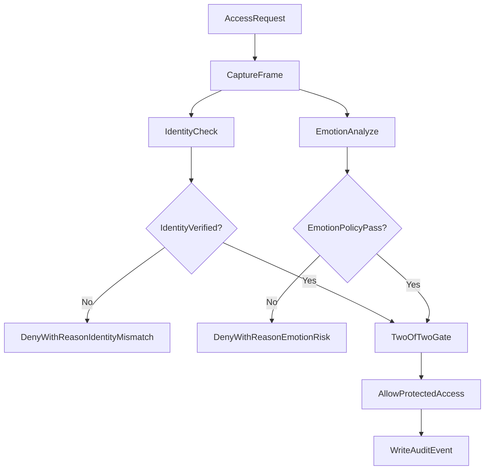

# Mission-Critical Access Gatekeeper

**Emotion Policy + Face Verification for High-Risk Operations**

[](https://www.python.org/)
[](https://github.com/serengil/deepface)
[](#use-cases)
[](LICENSE)

Quick links: [About](#about) | [Architecture](#architecture) | [Quick Start](#quick-start) | [Notebook Demo](#notebook-demo) | [Use Cases](#use-cases) | [Why Emotion Gating Matters](#why-emotion-gating-matters) | [Security Rules](#security-rules) | [Contributing](#contributing)

Docs: [Architecture](docs/architecture.md) | [Configuration](docs/configuration.md) | [Examples](docs/examples.md) | [Troubleshooting](docs/troubleshooting.md)

A DeepFace-based security framework that grants access only when identity verification and emotional-risk policy checks both pass.

## About

This repository demonstrates how to secure critical gateways using:
- face verification against a reference image or admin pool with multi-frame identity consensus,
- emotion classification with threshold + weighted policy,
- strict 2/2 authorization rule before protected action execution,
- multi-frame emotion voting with bounded retries and timeout handling.

## Architecture

1. Capture live frame from camera.
2. Verify identity against reference image and/or admin pool.
3. Analyze emotions and evaluate policy (`blocked_emotions`, weights, threshold).
4. If identity and emotion pass, grant access to the protected resource.
5. Write structured audit event for every decision.

Identity and emotion use separate thresholds:
- identity uses `identity.distance_threshold`,
- emotion uses `emotion.threshold`.



## Quick Start

### 1) Create environment

Primary runtime (Python 3.13):

```powershell
py -3.13 -m venv .venv
.\.venv\Scripts\Activate.ps1
python -m pip install -r requirements.txt
```

Note: on some Python 3.13 TensorFlow/DeepFace setups, `tf-keras` is required and is included in `requirements.txt`.

Fallback runtime when backend wheels fail:

```powershell
py -3.12 -m venv .venv-fallback
.\.venv-fallback\Scripts\Activate.ps1
python -m pip install -r requirements-fallback.txt
```

### 2) Configure runtime

```powershell
copy .env.example .env
```

### 3) Run terminal app

```powershell
python scripts/run_terminal.py --config-path config.yaml
```

The terminal flow is now:
- Step 1: identity source setup,
- Step 2: choose advanced configuration (`yes` to customize, `no` to use tuned production defaults).

Default non-advanced profile is optimized for speed:
- identity consensus: 5 frames / 2 matches required,
- emotion voting: 3 frames per batch, up to 2 batches.

Runtime output includes stage-level results:
- Identity check: pass/fail details
- Emotion check: pass/fail details
- Final decision: 2/2 pass or deny

### First-run model weights

On first identity verification run, DeepFace may try downloading `vgg_face_weights.h5` (used by `VGG-Face`) into:

`C:\Users\<your_user>\.deepface\weights\vgg_face_weights.h5`

If automatic download fails, run:

```powershell
curl.exe -L "https://github.com/serengil/deepface_models/releases/download/v1.0/vgg_face_weights.h5" -o "$env:USERPROFILE\.deepface\weights\vgg_face_weights.h5"
```

If your network blocks large downloads from GitHub, download the same URL in your browser and place the file at the same path.

On first emotion analysis run, DeepFace may also download `facial_expression_model_weights.h5`.  
After first-time downloads complete, subsequent runs are significantly faster.

TensorFlow startup logs are suppressed by default in launcher, but some backend messages may still appear depending on platform/runtime.

### Windows Unicode path note (`img2_path` errors)

On some Windows setups, OpenCV can fail reading image paths containing non-ASCII characters (for example Greek folder names), which may surface as:

- `Exception while processing img2_path`

The framework includes a Unicode-safe fallback loader (`numpy.fromfile` + `cv2.imdecode`) for reference/admin images.  
If you still see path-related failures, verify file readability and consider using an ASCII-only path for source images.

## Notebook Demo

Open `notebooks/security_framework_demo.ipynb` to run the interactive demo with widgets for:
- identity source,
- blocked emotions,
- identity consensus tuning (`frames_per_check`, `min_matches_required`, `distance_threshold`),
- emotion threshold + voting controls (`frames_per_batch`, `max_batches`),
- camera window toggle,
- resource naming and gated authorization flow.

## Use Cases

- Physical access control for restricted spaces.
- Access to privileged databases, tools, or microservices.
- Mission-critical infrastructure operations.
- Financial signing keys and sensitive document systems.
- AI inference gateways (optional example, not the primary focus).

## Why Emotion Gating Matters

Biometric identity confirms who requests access.  
Emotional risk analysis helps evaluate whether the person should proceed right now.

In high-impact environments, an otherwise authorized operator may pass face verification while still being in a compromised state, for example under coercion (such as being forced to authenticate) or severe distress (for example fear, panic, or aggression after a major personal conflict). This framework adds an emotional-risk gate to reduce approvals during those moments, helping protect critical infrastructure, high-value financial operations, and other irreversible systems where temporary instability can create outsized risk.

## Extensibility

- Add liveness detection and anti-spoofing.
- Add additional biometrics (voice, token, geofencing, hardware keys).
- Add policy profiles by environment and risk level.
- Attach a custom action executor for any protected workflow.

## Security Rules

Access is granted only when:
- identity verification succeeds, and
- weighted blocked-emotion score stays below threshold.

All denied decisions return deterministic reason messages.

If a stable emotional classification is not reached after configured batches, access is denied with guidance to retry under better camera/visibility conditions.

## Contributing

Contributions are welcome for policy modules, biometric extensions, and UI improvements.
Start by opening an issue that describes scope, risk, and test plan, then submit a PR with tests.
