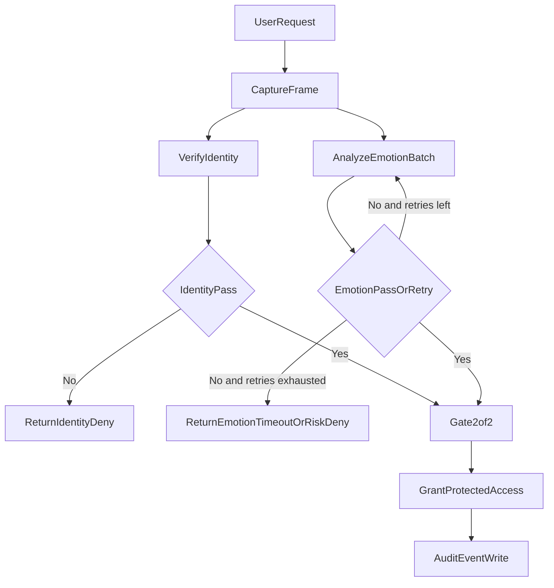

# Architecture

## Core Components

- `vision/camera.py`: frame capture.
- `vision/identity.py`: DeepFace verification against single reference or admin pool.
- `vision/emotion.py`: DeepFace emotion extraction + smoothing.
- `policy/evaluator.py`: weighted threshold checks.
- `gateway.py`: 2/2 gate orchestration with multi-frame identity consensus, multi-frame emotion voting, and timeout handling.
- `ui/overlay.py`: live camera overlay with face box, labels, and confidence bars.
- `ui/terminal_menu.py`: 2-step CLI (identity source + optional advanced tuning) and authorization.

## Access Flow

## Threat Model Framing

- Biometric identity confirms the requester is enrolled/authorized.
- Emotional analysis adds a situational safety layer for high-risk operations.
- This can reduce risk during coercion, panic, aggression, or other unstable states in mission-critical environments.
